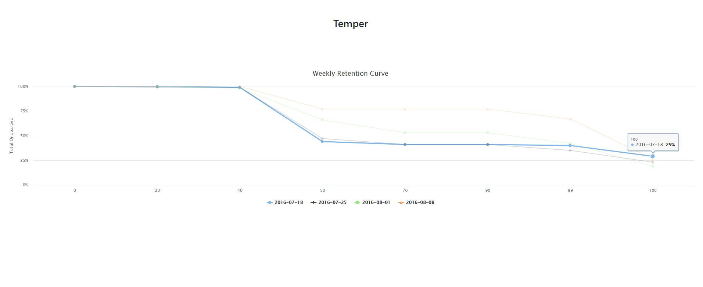

# Temper

### Project setup

Several packages were used for this project.
- **PHP-DI** for dependency injection. More information can be found here http://php-di.org/
- **Slim** for basic routing capability, used together with PHP-DI for container management Visit https://www.slimframework.com/docs/v4/ for details
- **Twig** to aid with generating the html https://twig.symfony.com/doc/2.x/
- **ParseCsv** to easily read the CSV file

In order to get the project up and running only a few steps need to be followed:
1. Download the project from git with `git clone git@github.com:alexe-emilian/temper.git`
2. Use `composer install` to get all the required dependencies
3. Start the server using the command: `php -S localhost:80 -t public` while in the project root

In order to run the tests and generate a coverage report in the path `reports` use the command: `vendor/bin/phpunit  tests --whitelist tests --coverage-html  reports/`

### Project overview
As it was mentioned in the **Project setup** section, both **PHP-DI** and **SLIM** were used to handle different aspects of the project.
The configuration for both the container and the routes can be found in the file `index.php` in the `public` directory.

Several services were also created, each of them focused on a specific task.
- `CsvService` is used to easily retrieve data from a CSV file through the method `getContents()`
- `UserRetentionChartService` generates the user retention chart data that will then be consumed by our frontend
    - Considering our very specific needs for this project no abstract chart service that could have then be extended was created. 
If one or more charts would have been necessary then an abstraction would have been beneficial and more strongly considered.

The layer that retrieves our data and that can easily be swapped so that the data is retrieved from the database, for example, instead of a CSV file is the `Repository` layer.
`UserProgressRepository` retrieves data from the CSV file through the `CsvService` and formats it into a more manageable format, an array of objects that implement `UserProgressInterface`.

In the `Enum` directory there are a few classes which hold values that are reused across the project and which help us remain consistent during development.

### Project flow

As it can be seen in the `index.php` file, the method `getRetentionChartDataAction()` in `UserProgressController` will return the data which will be consumed by `HighCharts` in order to generate the report.
From the controller the method `getUserRetentionChartData()` found in `UserRetentionChartService` is called which manipulates the data retrieved through our repository and returns the proper format for our frontend.

For the frontend side, **Twig** was used along with **Slim** to generate our html.
In the file `main.js` a quick call is made to the api endpoint and then the data is used to generate the chart which can be seen below

